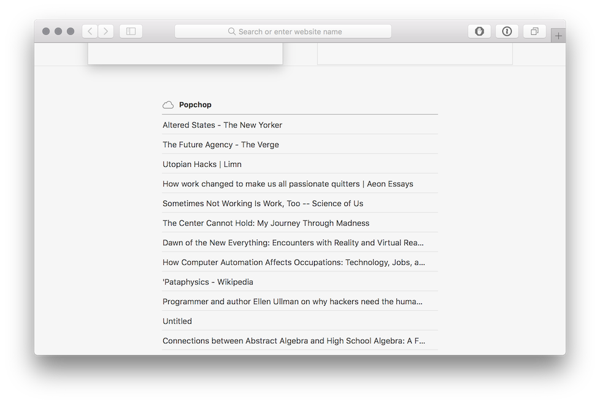

## CloudTabs

Ever wonder how Safari knows what tabs you have open in Mobile Safari?

It all happens via a key-value store in CloudKit, and there are some utilities to access that in a private framework, [SafariShared](http://developer.limneos.net/?ios=11.1.2&framework=SafariShared.framework). But why should Safari get to have all the fun?

This project has some headers for the relevant parts of the private framework, and a script to generate a stub to work around the issue of [linking against private frameworks in Xcode 8+](https://stackoverflow.com/questions/43962260/how-to-import-a-private-framework-in-xcode-8-3-without-getting-undefined-symbol).

Currently the demo program just dumps all the tabs on all your synced devices to `.webloc` files on your desktop. In the near-term I'd like to make a Chrome extension that understands cloud tabs and gives a nice interface around them.
