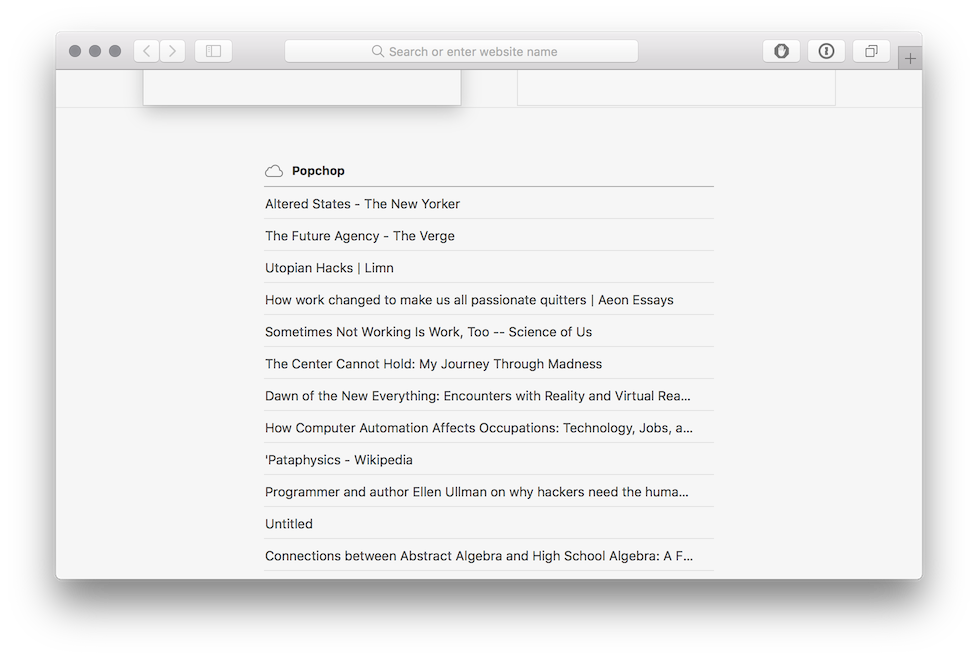
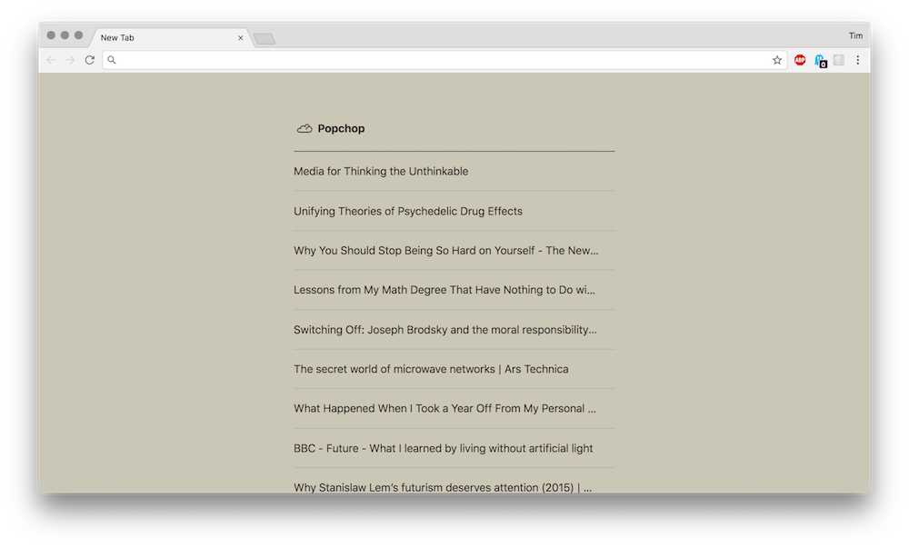

## CloudTabs

Ever wonder how Safari knows what tabs you have open in Mobile Safari?

It all happens via Apple's CloudKit, but why should Safari get to have all the fun?

This project has a Chrome extension that replaces the New Tab screen with one that's CloudTabs aware.

### Installation

This is a two-part installation, since Chrome extensions can't have bundled native components. It doesn't matter which order you do these in, but you will need to restart after installing the helper app.

* [Install the extension from the Chrome store](https://chrome.google.com/webstore/detail/lnaededecanoipjemdaffkkhlfbdlpan).
* [Install the native helper app](https://github.com/misterfifths/CloudTabs/releases/latest). Restart Chrome after this.

### Tech Details

There are some utilities to access the relevant CloudKit key-value store in a private framework, [SafariShared](http://developer.limneos.net/?ios=11.1.2&framework=SafariShared.framework). I didn't totally sidestep CloudKit permissions or anything, though you could argue that there's a security concern with any app effectively being able to read these. (It's just URLs, no other data, but still....)

The extension uses Chrome's [native messaging](https://developer.chrome.com/extensions/nativeMessaging) functionality to talk to a [native host](CloudTabs). This is great because it lets us talk to the private framework we need, but less great because it's a pain in the ass to set up. There's a barebones Obj-C implementation of one of those [here](CloudTabs/SynchronousNativeHost.h).

Also of interest: [some headers and helpers](CloudTabs/SafariShared) for the relevant parts of the private framework, and [a script](make-framework-stub) to generate a stub to work around the issue of [linking against private frameworks in Xcode 8+](https://stackoverflow.com/questions/43962260/how-to-import-a-private-framework-in-xcode-8-3-without-getting-undefined-symbol).

### Building

There's a script `make-package` in the root of the repo that will build everything and put a zip file of the extension and an installer package in the `dist` directory.

For a development of the extension, I've been runing `make-package` and pointing Chrome at the unpacked `build/extension` directory it makes. A manual build/install should go like this:

#### Get the extension going:

1. Generate a private key and ID for the extension, perhaps as suggested [here](https://stackoverflow.com/questions/37317779/making-a-unique-extension-id-and-key-for-chrome-extension).
2. Update the [extension manifest](extension/manifest.json) with the base-64-encoded key.
3. Update the version number in the [native host manifest](com.github.misterfifths.cloudtabs_host.json), while you're in there.

With those changes, the `extension` directory should be valid enough for Chrome to accept it as an unpacked extension in development mode.

#### And the native host:

1. Build the Xcode project. This will give you a binary in `build/app-support`.
2. Update the [native host manifest](com.github.misterfifths.cloudtabs_host.json) to allow requests from the origin `chrome-extension://<the-new-extension-id-you-just-generated>`.
3. Copy the native host manifest to `/Library/Google/Chrome/NativeMessagingHosts`.
4. Copy the host binary to `/Libary/Application Support/ChromeCloudTabs`.

For development, though, you might want to do the next thing instead:

#### Per-user installs

You can also install the native host and its manifest in a per-user directory: `~/Library/Application Support/Google/Chrome/NativeMessagingHosts`. **But**, the path to the host binary in the host manifest JSON must be absolute, so if you go this route, you'll need to pop it open and change the `path` value to `/Users/<your username>/Library/Application Support/Google/Chrome/NativeMessagingHosts/CloudTabs`.

Or, for development, you could just point the `path` to the `build/app-support` directory in your clone.

### Next steps

Pull requests welcome. I hate front-end stuff so, so, so much, so there's a lot that could be done there. See also the list of [TODOs](TODO.md).
